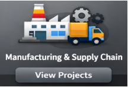

<!-- ========================= -->
<!-- HERO SECTION (TOP BANNER) -->
<!-- ========================= -->

<!-- ✅ SKY BLUE GRADIENT INTRO BOX (FULL) -->

  

  

<b>Full Stack Data Analyst</b> skilled in <b>Data Engineering</b>, <b>Analytics</b>, and <b>Dashboard Storytelling</b> — Transforming complex data into actionable insights and innovative solutions through advanced analytics and machine learning with <b>realtime Business effectiveness</b>.

  
  
  

 

<!-- Projects -->

<h2 align="center">🚀 My Projects</h2>

<b> A collection of Real-world business projects focused on solving business problems using data-driven insights in various business sector. </b>

  

  &nbsp;&nbsp;&nbsp;&nbsp;
  &nbsp;&nbsp;&nbsp;&nbsp;
  &nbsp;&nbsp;&nbsp;&nbsp;
  

  &nbsp;&nbsp;&nbsp;&nbsp;
  &nbsp;&nbsp;&nbsp;&nbsp;
  

  

<!-- HERO 2 COLUMN LAYOUT -->

<h2 align="center">💼 Professional Summary</h2>
<table style="border:none; border-collapse:collapse; width:100%;" cellspacing="0" cellpadding="0">
  
<tr style="border:none;">

  <td style="border:none; padding:0; vertical-align:top;">

### 💡 What I Do (My Strengths)
- Perform **deep analysis** &  Build **business-ready dashboards** (Power BI / Tableau) with KPI frameworks, drilldowns & storytelling
- Design **data pipelines** — scraping → cleaning → validation → transformation → data modeling
- Work with cloud & scalable tools — **AWS** + automation-friendly workflows
- **OS** - **Linux**
- **GIT** + **Github**

### 🔥 What Makes Me Different
- I don’t just “analyze data” — I **convert messy datasets into decision systems**
- Comfortable with both **analytics + engineering workflows**, so I can own projects end-to-end
- **Learning** - **ML**,**Deep Learning** + **Data Science**

🎯 Actively seeking:
**Full Stack Data Analyst** | **Business Analyst** | **BI Analyst** roles 

</td>

<!-- ✅ RIGHT SIDE IMAGE COLUMN -->
<td style="border:none; padding:0; vertical-align:top;">

   
    
   
 

   

   
 
  
   
  
  
   
   

</td>
</tr>
</table>

 

### ⚡ My Tech Stack

  
  
  

  
  
  
  
  
  

  
  
  

  

  

  
  
  

  

  
  
  

  

<h3 align="center">✨ Thank You for Visiting ✨</h3>

  

  
  

  &nbsp;&nbsp;&nbsp;&nbsp;
  
  &nbsp;&nbsp;&nbsp;&nbsp;
  &nbsp;&nbsp;&nbsp;&nbsp;

   
  &nbsp;&nbsp;&nbsp;&nbsp;
 &nbsp;&nbsp;&nbsp;&nbsp;

