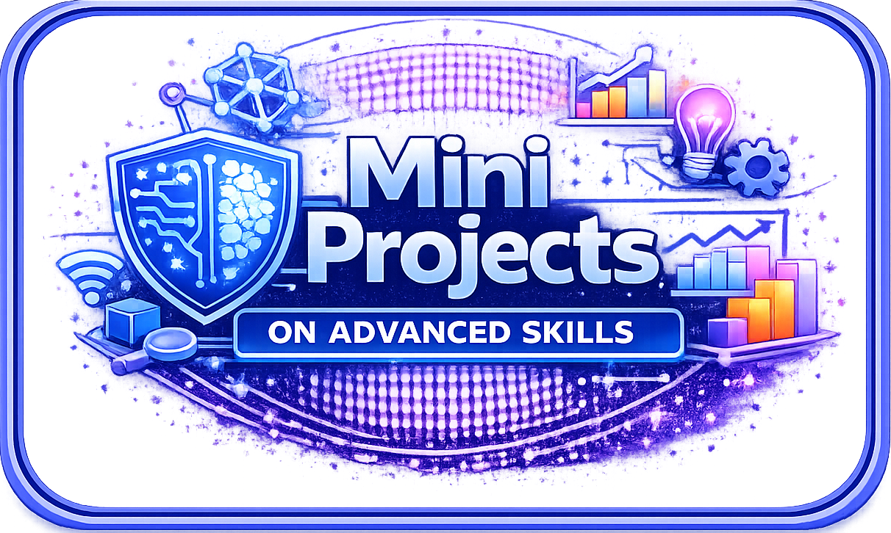

<!-- ========================= -->
<!-- HERO SECTION (TOP BANNER) -->
<!-- ========================= -->

<!-- ✅ SKY BLUE GRADIENT INTRO BOX (FULL) -->

  

  

<b>Full Stack Data Analyst</b> skilled in <b>Data Engineering</b>, <b>Analytics</b>, and <b>Dashboard Storytelling</b> — Transforming complex data into actionable insights and innovative solutions through advanced analytics and machine learning with <b>realtime Business effectiveness</b>.

  
  
  

 

<!-- Projects -->

<h2 align="center">📁 My Projects</h2>

<b> A collection of Real-world business projects focused on solving business problems using data-driven insights in various business sector. </b>

  

  

<b>1.</b> Understand Company Strategic Vision & Needs ➜
<b>2.</b> Project Overview ➜
<b>3.</b> Problem Statements ➜
<b>4.</b> Objectives ➜
<b>5.</b> Counter Questions to Stakeholders (Clarify Business Needs & Targets) ➜
<b>6.</b> EDA (Data Cleaning + Data Validation) + ETL Flowchart ➜
<b>7.</b> Data Modelling chart ➜
<b>8.</b> Live Power BI Dashboard ➜
<b>9.</b> Insights + Recommendations (Storytelling) ➜
<b>10.</b> Business Impact (Pre & Post Analysis) ➜
<b>11.</b> Challenges ➜
<b>12.</b> Enhancements ➜
<b>13.</b> Boardroom PPT with Storytelling

  

  &nbsp;&nbsp;&nbsp;&nbsp;

  &nbsp;&nbsp;&nbsp;&nbsp;

  &nbsp;&nbsp;&nbsp;&nbsp;

  

  &nbsp;&nbsp;&nbsp;&nbsp;

  &nbsp;&nbsp;&nbsp;&nbsp;

  &nbsp;&nbsp;&nbsp;&nbsp;

  

  

<!-- HERO 2 COLUMN LAYOUT -->

<h2 align="center">💼 Professional Summary</h2>

  <b>🤝 Open to full-time positions and professional collaborations — Feel free to reach out.</b>

<table style="border:none; border-collapse:collapse; width:100%;" cellspacing="0" cellpadding="0">
  
<tr style="border:none;">

  <td style="border:none; padding:0; vertical-align:top;">

### 💡 What I Do (My Strengths)
- Perform **deep analysis** &  Build **business-ready dashboards** (Power BI / Tableau) with KPI frameworks, drilldowns & storytelling
- Design **data pipelines** — scraping → cleaning → validation → transformation → data modeling
- Work with cloud & scalable tools — **AWS** + automation-friendly workflows
- **OS** - **Linux**
- **GIT** + **Github**

### 🔥 What Makes Me Different
- I don’t just “analyze data” — I **convert messy datasets into decision systems**
- Comfortable with both **analytics + engineering workflows**, so I can own projects end-to-end
- **Learning** - **ML** , **Deep Learning** + **Data Science** , **Databrics**

🎯 Actively seeking:
**Full Stack Data Analyst** | **Business Analyst** | **BI Analyst** roles 

</td>

<!-- ✅ RIGHT SIDE IMAGE COLUMN -->
<td style="border:none; padding:0; vertical-align:top;">

   
    
   
 

   

   
 
  
   
  
  
   
   

</td>
</tr>
</table>

 

<h2 align="center">⚡ My Tech Stack : </h2>
<table align="center">
   <tr>
     <td align="center" width="100">
      <a href="https://www.python.org/doc/" target="_blank">
         
        <b>Python</b>
      </a>
    </td>
      <td align="center" width="100">
      <a href="https://pandas.pydata.org/docs/" target="_blank" style="text-decoration:none;">
        
         
       <b>Pandas</b>
      </a>
    </td>
     <td align="center" width="100">
       <a href="https://numpy.org/doc/" target="_blank" style="text-decoration:none;">
        
         
        <b>NumPy</b>
      </a>
    </td>
      <td align="center" width="100">
      <a href="https://docs.scipy.org/doc/scipy/" target="_blank" style="text-decoration:none;">
        
         
        <b>SciPy</b>
      </a>
    </td>
      <td align="center" width="120">
      <a href="https://scikit-learn.org/stable/" target="_blank">
         
        <b>Scikit-Learn</b>
      </a>
    </td>
      <td align="center" width="100">
        <a href="https://spark.apache.org/docs/latest/api/python/" target="_blank">
         
        <b>PySpark</b>
      </a>
    </td>
    <td align="center" width="100">
      <a href="https://requests.readthedocs.io/en/latest/" target="_blank">
         
        <b>Requests</b>
      </a>
    </td>
     <td align="center" width="100">
     <a href="https://www.crummy.com/software/BeautifulSoup/bs4/doc/" target="_blank">
         
        <b>BeautifulSoup</b>
      </a>
     </td>
     
   </tr>
   

   <tr>
     <td align="center" width="100">
     <a href="https://docs.sqlalchemy.org/en/20/" target="_blank">
         
        <b>SQLAlchemy</b>
      </a>
    </td>
    <td align="center" width="120">
    <a href="https://openpyxl.readthedocs.io/en/stable/" target="_blank">
         
        <b>openpyxl</b>
      </a>
    </td>
     <td align="center" width="100">
       <a href="https://matplotlib.org/stable/" target="_blank">
         
        <b>Matplotlib</b>
      </a>
    </td>
    <td align="center" width="100">
     <a href="https://seaborn.pydata.org/" target="_blank">
     
    <b>Seaborn</b>
  </a>
    </td>
     <td align="center" width="100">
      <a href="https://plotly.com/python/" target="_blank">
         
        <b>Plotly</b>
      </a>
    </td>
     <td align="center" width="100">
      <a href="https://learn.microsoft.com/en-us/power-bi/" target="_blank">
         
        <b>Power BI</b>
      </a>
    </td>
    <td align="center" width="100">
    <a href="https://www.tableau.com/learn/training" target="_blank">
     
    <b>Tableau</b>
  </a>
    </td>
    <td align="center" width="100">
        <a href="https://support.microsoft.com/en-us/excel" target="_blank">
         
        <b>Excel</b>
      </a>
    </td>
  <tr>
      <td align="center" width="100">
      <a href="https://dev.mysql.com/doc/" target="_blank">
         
        <b>MySQL</b>
      </a>
    </td>
    <td align="center" width="100">
     <a href="https://learn.microsoft.com/en-us/sql/sql-server/" target="_blank">
         
        <b>MS SQL</b>
      </a>
    </td>
    <td align="center" width="120">
      <a href="https://docs.aws.amazon.com/" target="_blank">
         
        <b>AWS</b>
      </a>
    </td>
     <td align="center" width="110">
      <a href="https://learn.microsoft.com/en-us/azure/" target="_blank">
         
        <b>Azure</b>
      </a>
    </td>
       <td align="center" width="100">
        <a href="https://www.databricks.com/" target="_blank">
         
        <b>Databricks</b>
      </a>
    </td>
    <td align="center" width="100">
       <a href="https://git-scm.com/doc" target="_blank">
         
        <b>Git</b>
      </a>
    </td>
    <td align="center" width="100">
    <a href="https://docs.github.com/" target="_blank">
         
        <b>GitHub</b>
      </a>
  </a>
    </td>
     <td align="center" width="110">
      <a href="https://www.linux.org/" target="_blank">
         
        <b>Linux</b>
      </a>
      </a>
    </td>
   </tr>  
</table>
<h3 align="center"> ⭐⭐ Learning Tools : </h3>
<table align="center">
  <tr>
     <td align="center" width="100">
       <a href="https://pytorch.org/docs/stable/index.html" target="_blank">
         
        <b>PyTorch</b>
      </a>
    </td>
   <td align="center" width="120">
      <a href="https://mlflow.org/docs/latest/index.html" target="_blank">
         
        <b>MLflow</b>
      </a>
    </td>
     <td align="center" width="100">
       <a href="https://streamlit.io/" target="_blank">
         
        <b>Streamlit</b>
      </a>
    </td>
  <td align="center" width="100">
       <a href="https://www.tensorflow.org/learn" target="_blank">
         
        <b>TensorFlow</b>
      </a>
    </td>
     <td align="center" width="120">
      <a href="https://keras.io/" target="_blank">
         
        <b>Keras</b>
      </a>
    </td>
    <td align="center" width="100">
        <a href="https://huggingface.co/docs" target="_blank">
         
        <b>Hugging Face</b>
      </a>
    </td>
    <td align="center" width="100">
     <a href="https://python.langchain.com/docs/" target="_blank">
         
        <b>LangChain</b>
      </a>
    </td>
     <td align="center" width="110">
      <a href="https://www.langchain.com/langgraph" target="_blank">
         
        <b>LangGraph</b>
      </a>
    </td>
      <td align="center" width="100">
       <a href="https://www.selenium.dev/documentation/" target="_blank">
         
        <b>Selenium</b>
      </a>
    </td>
  </tr>
</table>

---

<h3 align="center">✨ Thank You for Visiting ✨</h3>

  

  
  

